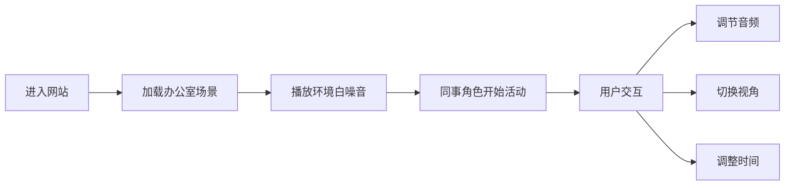

## 1. 产品概述

沉浸式在线办公室是一个基于 Web 的虚拟办公环境模拟器，通过 2.5D 等距视角呈现办公室布局，配合动态同事角色和 3D 空间音频技术，为远程工作者提供身临其境的办公室氛围体验。

- 目标用户：远程办公人群、自由职业者、需要专注力氛围的学习者
- 核心价值：缓解居家办公的孤独感，提供模拟真实办公室的白噪音环境，提升工作专注度

## 2. 核心功能

### 2.1 用户角色
| 角色 | 注册方式 | 核心权限 |
|------|----------|----------|
| 访客用户 | 无需注册，直接进入 | 浏览办公室场景、调节音频、切换工位视角 |

### 2.2 功能模块
1. **主场景页面**：办公室全景视图、动态同事角色、实时时间模拟
2. **音频控制面板**：各区域音量调节、独立音源开关、总音量控制
3. **视角切换系统**：不同工位视角切换、第一人称/全景模式切换
4. **时间模拟系统**：上下班时间动态变化、同事作息行为模拟

### 2.3 页面详情
| 页面名称 | 模块名称 | 功能描述 |
|----------|----------|----------|
| 主场景页 | 办公室全景 | 2.5D 等距视角办公室布局，包含工位区、会议室、茶水间、休息区 |
| 主场景页 | 动态同事 | 多名同事角色在办公室内移动、交谈、工作，行为符合真实办公节奏 |
| 主场景页 | 空间音频 | 不同位置发出不同白噪音（键盘声、交谈声、咖啡机声、空调声等），随视角变化音量和方位 |
| 控制面板 | 音频调节 | 独立控制各区域/各音源的音量，主音量控制，静音开关 |
| 控制面板 | 视角切换 | 快速切换到不同工位视角，自由视角漫游模式 |
| 控制面板 | 时间控制 | 调整模拟时间（早/中/晚），影响光线和同事行为 |

## 3. 核心流程

用户进入网站后，首先看到办公室全景，自动播放办公室环境音。用户可以：
- 通过控制面板调节各区域音量
- 点击不同工位切换视角，体验不同位置的声音效果
- 观察同事在办公室内的动态活动
- 调整时间设定，体验不同时段的办公室氛围

## 4. 用户界面设计

### 4.1 设计风格
- **主色调**：温暖米白色 (#F5F1EB) 作为背景，搭配深胡桃木色 (#3D2B1F) 和柔和绿色 (#7BA05B) 点缀
- **辅助色**：暖橙色 (#E8A87C) 用于高亮交互元素
- **整体风格**：温馨舒适的现代办公室风格，柔和光影，营造真实办公氛围
- **字体**：标题使用 serif 风格字体增加质感，正文使用干净的无衬线字体
- **按钮风格**：圆角矩形，微浮雕效果，悬停时有轻微上浮和阴影变化
- **图标风格**：线性简约图标，统一 2px 描边

### 4.2 页面设计概述
| 页面名称 | 模块名称 | UI 元素 |
|----------|----------|---------|
| 主场景页 | 办公室场景 | 2.5D 等距视图、渐变色背景、柔和阴影、动态光影效果 |
| 主场景页 | 同事角色 | 简约卡通风格人物、行走/打字/交谈等动画状态 |
| 控制面板 | 侧边抽屉 | 半透明毛玻璃效果、滑入动画、分组折叠 |
| 控制面板 | 音量滑块 | 自定义样式滑块、当前音量指示、静音按钮 |
| 控制面板 | 视角选择 | 工位缩略图网格、选中态高亮、悬停预览 |
| 顶部状态栏 | 时间显示 | 模拟时钟、日期显示、上下班状态指示 |

### 4.3 响应式
- 桌面端优先设计，横向布局
- 平板端适配：控制面板改为底部抽屉
- 移动端：简化场景，保留核心音频功能

### 4.4 场景氛围设计
- **环境/光照**：日间柔和自然光从窗户射入，傍晚转为暖黄色灯光，夜间为深蓝色夜景
- **光影效果**：使用径向渐变模拟光影，物体投影随时间变化
- **相机设置**：默认 45° 等距俯视视角，支持平滑过渡切换到不同工位
- **构图与焦点**：办公室居中布局，视觉焦点在中央工位区，周围环绕功能区
- **交互动画**：同事移动使用缓动曲线，视角切换使用平滑过渡，按钮悬停有微交互
- **后处理效果**：轻微模糊模拟景深，暗角效果增强沉浸感
- **性能优化**：使用 CSS 动画而非 JS 动画，人物精灵使用 CSS transform，音频使用 Web Audio API 空间化
