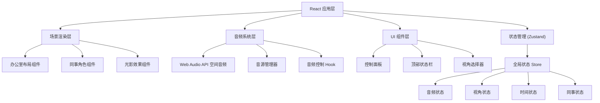

## 1. 架构设计



## 2. 技术描述

- **前端框架**：React 18 + TypeScript
- **构建工具**：Vite 5
- **样式方案**：Tailwind CSS 3
- **状态管理**：Zustand
- **图标库**：Lucide React
- **音频技术**：Web Audio API (PannerNode 实现空间音频)
- **动画方案**：CSS Animations + Transitions + requestAnimationFrame
- **后端**：无（纯前端应用）
- **数据库**：无

## 3. 路由定义

| 路由 | 用途 |
|------|------|
| / | 主场景页面 - 办公室全景与控制面板 |

## 4. 项目结构

```
src/
├── components/
│   ├── office/
│   │   ├── OfficeScene.tsx       # 办公室主场景
│   │   ├── OfficeLayout.tsx      # 办公室布局（家具、工位等）
│   │   ├── Colleague.tsx         # 同事角色组件
│   │   └── Lighting.tsx          # 光影效果组件
│   ├── controls/
│   │   ├── ControlPanel.tsx      # 控制面板
│   │   ├── AudioControls.tsx     # 音频控制
│   │   ├── ViewSelector.tsx      # 视角选择器
│   │   └── TimeControls.tsx      # 时间控制
│   └── ui/
│       ├── Slider.tsx            # 自定义滑块组件
│       ├── Toggle.tsx            # 开关组件
│       └── StatusBar.tsx         # 顶部状态栏
├── hooks/
│   ├── useAudioEngine.ts         # 音频引擎 Hook
│   ├── useSpatialAudio.ts        # 空间音频 Hook
│   └── useTimeSimulation.ts      # 时间模拟 Hook
├── store/
│   └── useOfficeStore.ts         # 全局状态 Store
├── types/
│   ├── audio.ts                  # 音频类型定义
│   ├── colleague.ts              # 同事类型定义
│   └── office.ts                 # 办公室类型定义
├── utils/
│   ├── audioUtils.ts             # 音频工具函数
│   └── animationUtils.ts         # 动画工具函数
├── data/
│   ├── colleagues.ts             # 同事配置数据
│   ├── audioSources.ts           # 音源配置数据
│   └── officeLayout.ts           # 办公室布局数据
├── App.tsx
├── main.tsx
└── index.css
```

## 5. 核心技术方案

### 5.1 空间音频实现
- 使用 Web Audio API 的 `PannerNode` 实现 3D 空间音频
- 每个音源绑定到办公室内的具体坐标
- 根据用户视角位置动态计算音量和左右声道平衡
- 距离衰减使用线性模型，模拟真实声音传播

### 5.2 同事动画系统
- 使用 CSS keyframes 实现基础行走、打字动画
- 状态机管理同事行为状态（工作、行走、交谈、休息）
- 随机行为调度器，模拟真实办公节奏
- requestAnimationFrame 实现平滑位置过渡

### 5.3 2.5D 等距视角
- CSS transform: rotateX + rotateZ 实现等距视角效果
- 按 z-index 排序实现层级遮挡
- 透视变换增强空间感

### 5.4 时间系统
- 实时时间模拟，支持加速/减速
- 根据时间自动切换光线效果
- 同事行为随时间变化（上班、午休、下班）

## 6. 数据模型

### 6.1 音源数据模型
```typescript
interface AudioSource {
  id: string;
  name: string;
  type: 'keyboard' | 'conversation' | 'coffee' | 'printer' | 'ac' | 'ambient';
  position: { x: number; y: number };
  volume: number;
  muted: boolean;
  loop: boolean;
  coneInnerAngle?: number;
  coneOuterAngle?: number;
}
```

### 6.2 同事数据模型
```typescript
interface Colleague {
  id: string;
  name: string;
  avatar: string;
  position: { x: number; y: number };
  state: 'working' | 'walking' | 'talking' | 'resting';
  targetPosition?: { x: number; y: number };
  schedule: {
    arriveTime: number;
    lunchTime: number;
    leaveTime: number;
  };
}
```

### 6.3 视角数据模型
```typescript
interface ViewPoint {
  id: string;
  name: string;
  position: { x: number; y: number };
  zoom: number;
  description: string;
}
```
